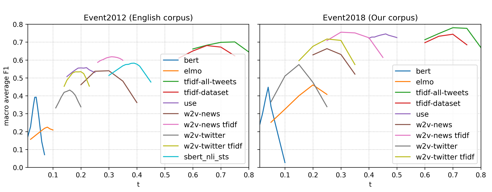

# Sentence embeddings for unsupervised event detection in the Twitter stream: study on English and French corpora

This repo aims at letting researchers reproduce our Twitter event detection results on 2 datasets:
the [Event2012 dataset](https://cs.adelaide.edu.au/~wei/sublinks/papers/2.1.2013CIKM.Building%20a%20Large-scale%20Corpus%20for%20Evaluating%20Event.pdf)
(tweets in English) and the Event2018 dataset (tweets in French, a full description of this dataset
is provided in [our paper](http://www.lrec-conf.org/proceedings/lrec2020/pdf/2020.lrec-1.763.pdf).)

Since some tweets have probably been erased since we collected the datasets, we cannot ensure 100% identical results,
 but we are confident that the comparative performance of the models will remain unchanged.
 
 Details of the implemented approaches can be found in our publication: 
Mazoyer, B., Hervé, N., Hudelot, C., & Cagé, J. (2020). 
[“Représentations lexicales pour la détection non supervisée d’événements dans un flux de tweets : 
étude sur des corpus français et anglais”.](https://arxiv.org/abs/2001.04139)
 In “Extraction et Gestion des Connaissances (EGC 2020)”.
 
 If you don't speak French, the broad principles of the event detection method are detailed in:
 Mazoyer, B., Cagé, J., Hervé, N. & Hudelot, C. (2020). [“A French Corpus for Event Detection on 
Twitter”](http://www.lrec-conf.org/proceedings/lrec2020/pdf/2020.lrec-1.763.pdf).
In *“International Conference on Language Resources and Evaluation (LREC 2020)”*,  6220–6227.
 
 
*Results of our unsupervised event detection (clustering) algorithm for each embedding type, depending on the threshold (t) parameter.*

Some of the embeddings presented on this graph are not available here: 
* English corpus: w2v-twitter
* French corpus: w2v-news, w2v-twitter, elmo

All other embeddings are available and the corresponding modules are listed in the `requirements.txt` file.
You will only need to install the `bert-as-service` module ([see the BERT section](#bert-bert)) and run the BERT server 
to test the BERT embedding.

## Summary:
* [Installation](#installation)
* [Download Event2012 dataset](#download-event2012-dataset)
    * [Download tweets' IDs](#download-tweets-ids)
    * [Create Twitter API access tokens](#create-twitter-api-access-tokens)
    * [Download tweets' content](#download-tweets-content)
* [Download Event2018 dataset](#download-event2018-dataset)
* [Use 'First Story Detection' on you own dataset](#use-first-story-detection-on-you-own-dataset)
* [Clustering](#clustering)
* [Classification](#classification)
* [Available embeddings](#available-embeddings)
    * [tf-idf](#tf-idf-tfidf_dataset-or-tfidf_all_tweets)
    * [Word2Vec](#word2vec-w2v_gnews_en)
    * [ELMo](#elmo-elmo)
    * [BERT](#bert-bert)
    * [Universal Sentence Encoder](#universal-sentence-encoder-use)
    * [Sentence-BERT](#sentence-bert-sbert_nli_sts)

## Installation
We recommand using Anaconda 3 to create a python 3.6 environment 
(install Anaconda [here](https://docs.anaconda.com/anaconda/install/)):

    conda create -n "twembeddings" python=3.6.9
    source activate twembeddings
    
Then clone the repo and install the module:

    cd $HOME
    git clone https://github.com/bmaz/twembeddings.git
    cd twembeddings
    pip install .
    
## Download Event2012 dataset

### Download tweets' IDs
In compliance with Twitter terms of use, the authors of the dataset do not share the tweets content,
but only the tweets IDs. Accept the 
[dataset agreement](https://docs.google.com/forms/d/e/1FAIpQLSfRQX4R2O_Pv26wuepydKS4xxi6QbLrhaCgJaAXPcKx7dDljQ/viewform)
and download the dataset. Untar the folder, the labeled tweets are in the `relevant_tweets.tsv` file. 

### Create Twitter API access tokens
We provide a script to download the tweets' content from the Twitter API. In order to run the script,
you need to [create a Twitter developper account and a Twitter App](https://developer.twitter.com/en/docs/basics/apps/overview).
Then get the app's [access tokens](https://developer.twitter.com/en/docs/basics/authentication/guides/access-tokens).
You should now have 4 tokens (the following strings are random examples):
- app_key: mIsU1P0NNjUTf9DjuN6pdqyOF
- app_secret: KAd5dpgRlu0X3yizTfXTD3lZOAkF7x0QAEhAMHpVCufGW4y0t0
- oauth_token: 4087833385208874171-k6UR7OGNFdfBcqPye8ps8uBSSqOYXm
- oauth_token_secret: Z9nZBVFHbIsU5WQCGT7ZdcRpovQm0QEkV4n4dDofpYAEK

### Download tweets' content
Run the script:

    python get_tweets_objects.py \
    --path /yourpath/relevant_tweets.tsv \
    --dataset event2012 \
    --app_key mIsU1P0NNjUTf9DjuN6pdqyOF \
    --app_secret KAd5dpgRlu0X3yizTfXTD3lZOAkF7x0QAEhAMHpVCufGW4y0t0 \
    --oauth_token 4087833385208874171-k6UR7OGNFdfBcqPye8ps8uBSSqOYXm \
    --oauth_token_secret Z9nZBVFHbIsU5WQCGT7ZdcRpovQm0QEkV4n4dDofpYAEK

The script may take some time to run entirely, since it respects the API's 
[rate limit](https://developer.twitter.com/en/docs/basics/rate-limits).
Because of tweets beeing removed and Twitter accounts being closed, some tweets
are no longer available. Our last download (November 2019) allowed us to retrieve
72484 tweets (72% of the original dataset).

## Download Event2018 dataset

In compliance with Twitter terms of use, we do not share the tweets content,
but only the tweets IDs. The corpus is available [here](https://dataset.ina.fr/corpus/index.action?request_locale=en).
Please fill-in the agreement form and indicate the name of the corpus (Event2018) in your application.
Untar the folder, the labeled tweets are in the `relevant_tweets.tsv` file. 

You can then download the full tweet content by 
[creating your Twitter access tokens](#create-twitter-api-access-tokens) and running the script:

    python get_tweets_objects.py \
    --path /yourpath/relevant_tweets.tsv \
    --dataset event2018 \
    --app_key mIsU1P0NNjUTf9DjuN6pdqyOF \
    --app_secret KAd5dpgRlu0X3yizTfXTD3lZOAkF7x0QAEhAMHpVCufGW4y0t0 \
    --oauth_token 4087833385208874171-k6UR7OGNFdfBcqPye8ps8uBSSqOYXm \
    --oauth_token_secret Z9nZBVFHbIsU5WQCGT7ZdcRpovQm0QEkV4n4dDofpYAEK

The script may take some time to run entirely, since it respects the API's 
[rate limit](https://developer.twitter.com/en/docs/basics/rate-limits).
Because of tweets beeing removed and Twitter accounts being closed, some tweets
are no longer available. Our last download (November 2019) allowed us to retrieve
77249 tweets (81% of the original dataset).

## Use 'First Story Detection' on you own dataset

Save your Twitter data in the form of a tsv file (csv file with "\t" as separator)
in the `data` folder with the following column names: 

| id   | label | text  | created_at |
|:-----|:------|:------|:-----------|

`created_at` is the date of the tweet. The format can be either `2018-07-16 05:00:56`
or `Mon Jul 16 05:00:56 +0000 2018` (Twitter format).
`label` is the ground truth that you may use to evaluate the algorithm. 
You can leave the column empty if you have no ground truth. 

You can then run something like this ( `--annotation no` indicates that you have no annotated ground truth):

    python clustering.py --dataset data/yourfile.tsv --lang fr --model tfidf_dataset --threshold 0.7 --annotation no

A new file with the predicted labels in column "pred" will be saved in `data/yourfile_results.tsv`.
The evaluation of the chosen parameters (if you have ground truth labels to evaluate on) will be saved to
`results_clustering.csv`.

## Clustering
Run clustering with one or several embedding names as `model` parameter.

    python clustering.py --dataset data/event2012.tsv --lang en --model tfidf_dataset w2v_gnews_en sbert_nli_sts

or

    python clustering.py --dataset data/event2018.tsv --lang fr --model tfidf_dataset tfidf_all_tweets use

You can test several threshold parameters for the First Story Detection
Algorithm by modifying the 
[options.yaml](https://github.com/ina-foss/twembeddings/blob/master/options.yaml)
file.
### Indicative best results
| Model                     | t (en)| F1 (en)| t (fr)              | F1 (fr)|
|:--------------------------|:------|:-------|:--------------------|:-------|
| bert                      | 0.04  | 39.22  | 0.04                | 44.79  |
| bert-tweets               | -     | -      | 0.02                | 50.02  |
| elmo                      | 0.08  | 22.48  | 0.2                 | 46.08  |
| sbert-nli-sts             | 0.39  | 58.24  | -                   | -      |
| tfidf-all-tweets          | 0.75  | 70.1   | 0.7                 | 78.05  |
| tfidf-dataset             | 0.65  | 68.07  | 0.7                 | 74.39  |
| use                       | 0.22  | 55.71  | 0.46                | 74.57  |
| w2v-news                  | 0.3   | 53.99  | 0.25                | 66.34  |
| w2v-news tfidf-weights    | 0.31  | 61.81  | 0.3                 | 75.55  |
| w2v-twitter               | 0.16  | 43.2   | 0.15                | 57.53  |
| w2v-twitter tfidf-weights | 0.2   | 53.45  | 0.25                | 71.73  |

## Classification
Run classification with one or several embedding names as `model` parameter.

    python classification.py --dataset data/event2012.tsv --lang en --model tfidf_dataset w2v_gnews_en sbert_nli_sts
    
or

    python classification.py --dataset data/event2018.tsv --lang fr --model tfidf_dataset bert   

Additionnal options for each model can be modified in 
[options.yaml](https://github.com/ina-foss/twembeddings/blob/master/options.yaml)
### Indicative results (average F1 on 5 runs ± standard deviation)
| Model                     |F1±std (en) |F1±std (fr) |
|:--------------------------|:-----------|:-----------|
| bert                      | 74.49±0.41 | 78.46±0.68 |
| bert-tweets               | -          | 81.77±0.7  |
| elmo                      | 59.81±0.41 | 73.59±0.64 |
| sbert-nli-sts             | 80.55±0.33 | -          |
| tfidf-all-tweets          | 83.5±0.78  | 87.79±0.58 |
| tfidf-all-tweets svd      | 62.4±0.72  | 75.32±0.88 |
| tfidf-dataset             | 83.46±0.72 | 87.66±0.69 |
| tfidf-dataset svd         | 58.24±0.52 | 75.92±0.56 |
| use                       | 80.26±0.38 | 87.45±0.6  |
| w2v-news                  | 81.35±0.53 | 86.59±0.8  |
| w2v-news tfidf-weights    | 82.39±0.64 | 87.51±0.71 |
| w2v-twitter               | 76.68±0.53 | 87.01±0.56 |
| w2v-twitter tfidf-weights | 81.2±0.48  | 87.73±0.56 |

## Available embeddings
##### Tf-idf (`tfidf_dataset` or `tfidf_all_tweets`): 
Since the same word is rarely used several times in the same tweet, we used
the idf expression rather than the tfidf

=1&plus;log\frac{n&plus;1}{df(t)&plus;1})

With option `tfidf_dataset`, only the annotated tweets are used to count words.
With option `tfidf_all_tweets`, all tweets in the corpora (millions of tweets) are used to count words.
##### Word2Vec (`w2v_gnews_en`)
 [Google model pretrained on google news](https://code.google.com/archive/p/word2vec/) with mean-pooling of word representations as sentence embedding.
<!---
##### w2v-twitter
[Model pretrained on tweets](github.com/loretoparisi/word2vec-twitter) with mean-pooling of word representations as sentence embedding.
--->
##### ELMo (`elmo`)
Pretrained model on [TensorFlow Hub](https://tfhub.dev/google/elmo/2) with mean-pooling of word representations as sentence embedding. 
##### BERT (`bert`)
In case you want to use BERT embeddings, you need to install `bert-as-service`:

    pip install bert-serving-server
    pip install bert-serving-client
    
Then follow the [guidelines](https://github.com/hanxiao/bert-as-service#getting-started) to download a BERT model 
(we used [BERT-Large, Cased](https://storage.googleapis.com/bert_models/2018_10_18/cased_L-24_H-1024_A-16.zip)
for English and 
[BERT-Base, Multilingual Cased](https://storage.googleapis.com/bert_models/2018_11_23/multi_cased_L-12_H-768_A-12.zip)
for French) 
and start the BERT service:

    bert-serving-start -model_dir=/yourpath/cased_L-24_H-1024_A-16 -max_seq_len=500 -max_batch_size=64
    
or
    
    bert-serving-start -model_dir=/yourpath/multi_cased_L-12_H-768_A-12 -max_seq_len=500 -max_batch_size=64
 
Our program will act as a client to this service.
We use the default parameters of `bert-as-service` : the pooling layer is the second-to-last layer,
and mean-pooling is used for sentence embedding.

##### Universal Sentence Encoder (`use`)
Pretrained model on [TensorFlow Hub](https://tfhub.dev/google/universal-sentence-encoder-large/3).
The [multilingual model](https://tfhub.dev/google/universal-sentence-encoder-multilingual/1) was used for French.

##### Sentence-BERT (`sbert_nli_sts`)
Pretrained model from [UKPLab](https://github.com/UKPLab/sentence-transformers#pretrained-models). 
We use bert-large-nli-stsb-mean-tokens model.